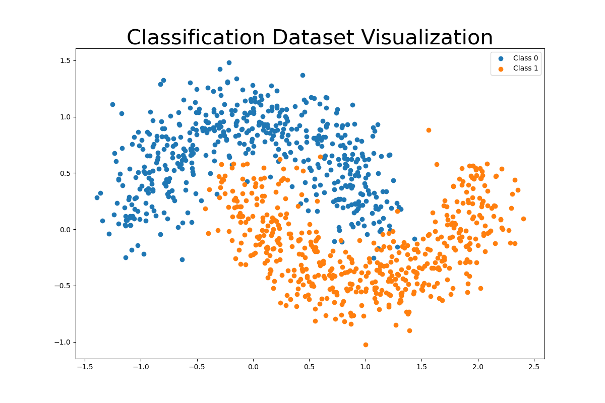
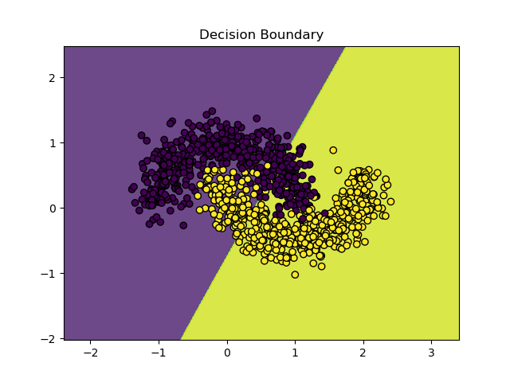
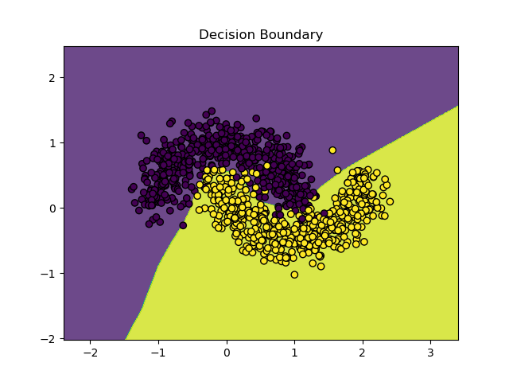

## Sigmoid Activator

**训练**:

Epoch: #100, MSE: 0.246815, Accuracy: 75.33%

**结论**：

按理来说，加上 **SigmoidActivator** 是可以进行非线性拟合的，但实验结果却是线性的。

欢迎issue，期待你的看法

## ReLU Activator

**训练**:

Epoch: #100, MSE: 0.033762, Accuracy: 95.00%

**结论**：

可见ReLU的优秀, 后续我们还会遇见ReLU的