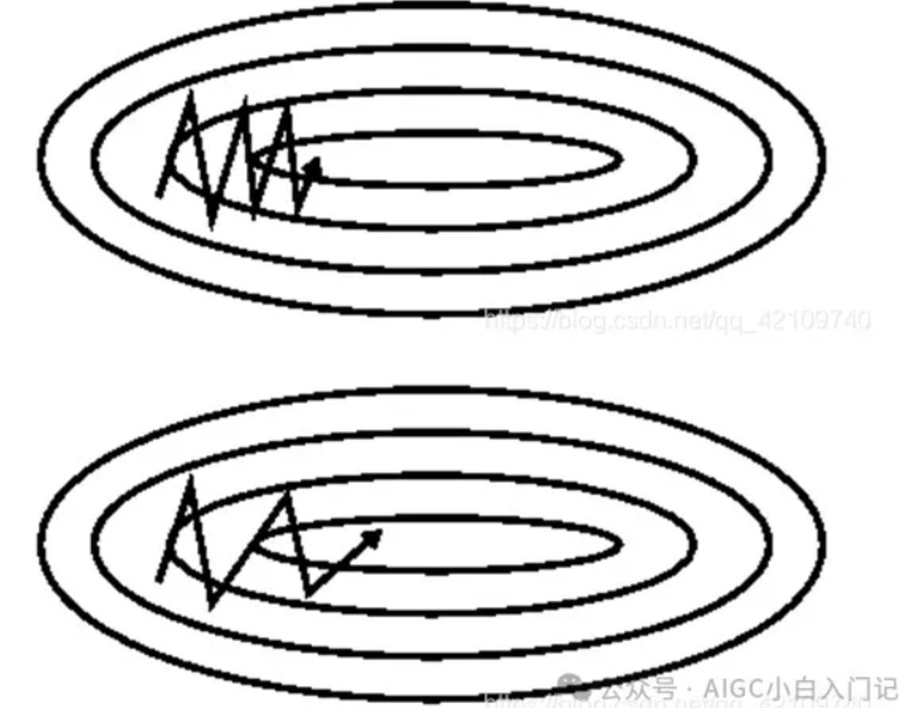

# 优化器

优化器是为了解决梯度下降时，可能出现的梯度消失(在局部最优解，梯度接近0，参数更新很慢)和梯度爆炸(梯度太大，更新一次，参数飞到十万八千里)，以及加快下降的速度和精度(这里的精度指：每次更新方向向着最优点的偏差)

所以根据上面优化器的作用，我们可以发现优化器是作用在 **反向传播后的参数更新阶段** ，对参数更新进行优化的部件。

如果想了解最有效的优化器，建议直接看[Adam](###5-adam自适应矩估计)

下面是不同优化器的效果图：

### 1. SGD(随机梯度下降)

最基本的参数更新方法。

随机梯度下降是对每个训练样本就更新一次网络参数，这样使得网络更新参数速度很快。

但是问题就是由于训练数据多样，容易朝偏离网络最优点方向训练，网络训练不稳定。

### 2. Momentum SGD(带动量的随机梯度下降)

Momentum SGD的数学公式如下：

$$ m_t = \beta m_{t-1} + (1 - \beta) \frac{\partial (Loss)}{\partial \theta_t} $$

其中：
- $m_t$ 是当前时刻的动量, 类似于所有要训练更新的参数的一维向量
  
- $\beta$ 是动量系数，通常是一个介于0和1之间的值
  
- $m_{t-1}$ 是前一时刻的动量
  
- $\frac{\partial (Loss)}{\partial \theta_t}$ 是当前参数的梯度

这个公式表示动量是前一时刻动量的一个指数衰减和当前梯度的线性组合。动量项帮助加速梯度下降在相关方向上的进展，并抑制在不相关方向上的震荡。

> SGD在随机挑选某一分量的梯度方向进行收敛,加一个“动量”的话，相当于有了一个惯性在里面。
> 
> 如果本次和上次的梯度符号是相同的，那么就能够加速下降（幅度变大），就能够解决原先下降太慢的问题；
>
> 如果本次和上次的梯度符号是相反的，那么这次就和上次相互抑制，减缓震荡。
>
> 由于有动量的作用，在局部最优点时，它可以借助动量跳出来，不易陷入局部最优点。

上面上图没有加动量，下图加了动量的方法，可以看到有动量可以在变化小的维度上加快更新使得加快收敛。

### 3. Adagrad

参考下面的链接，简短清楚

[Adagrad简短讲解](https://blog.csdn.net/qq_45193872/article/details/124153859)

所以这个**Adagrad**的学习率大小的曲线会一直下降

### 4. RMSprop

**RMSprop** 和 **Adagrad** 从数学公式上来说，基本一样，它们是在相同时间被独立的提出，下面就不赘述了。

RMSprop的数学公式如下：

1. 动量更新（可选）：
$$ m_t = \beta m_{t-1} + (1 - \beta) g_t $$

2. 平方梯度更新：
$$ V_t = \gamma V_{t-1} + (1 - \gamma) g_t^2 $$

3. 参数更新：
$$ \theta_{t+1} = \theta_t - \eta \frac{m_t}{\sqrt{V_t + \epsilon}} $$

其中：
- $m_t$ 是当前时刻的动量，
- $g_t$ 是当前梯度，
- $V_t$ 是梯度平方的指数加权平均，
- $\theta_t$ 是当前参数值，
- $\eta$ 是学习率，
- $\gamma$ 是梯度平方的衰减率，
- $\epsilon$ 是一个小的常数，用于防止除以零。

RMSprop算法通过梯度平方的指数加权平均来调整每个参数的学习率，从而实现自适应学习率。动量项是可选的，用于加速梯度下降并减少震荡。

> RMSprop算法由hinton教授提出，教授建议将 $\gamma $设置为0.9，对于学习率，一个好的固定值为0.001。

    想一想：RMSprop 和 Adagrad 有什么不一样？

    Adagrad 对所有参数使用相同的学习率，并且随着时间推移，学习率会逐渐减小，因为累积的梯度平方和会不断增大。

    RMSprop 通过使用指数加权平均来计算梯度平方的衰减平均值，从而解决了Adagrad学习率逐渐减小的问题。这意味着RMSprop允许学习率在训练过程中保持相对稳定，而不是持续减小。

### 5. Adam(自适应矩估计)

这个是大杀器，可以说相较前面的优化器，它更有效，当然也更复杂，但也复杂不到哪里去。

Adam优化器是结合了Momentum和RMSprop优点的一种优化方法。它通过计算梯度的一阶矩估计（即均值）和二阶矩估计（即方差），从而调整每个参数的学习率。Adam优化器的更新规则如下：

1. 计算梯度的一阶矩估计（即均值）：
   $$ m_t = \beta_1 m_{t-1} + (1 - \beta_1) g_t $$

2. 计算梯度的二阶矩估计（即方差）：
   $$ V_t = \beta_2 V_{t-1} + (1 - \beta_2) g_t^2 $$

3. 对一阶矩估计和二阶矩估计进行偏差校正：
   $$ \hat{m}_t = \frac{m_t}{1 - \beta_1^t} $$
   $$ \hat{V}_t = \frac{V_t}{1 - \beta_2^t} $$

4. 参数更新：
   $$ \theta_{t+1} = \theta_t - \eta \frac{\hat{m}_t}{\sqrt{\hat{V}_t} + \epsilon} $$

其中：
- $m_t$ 是当前时刻的一阶矩估计，
- $V_t$ 是当前时刻的二阶矩估计，
- $\beta_1$ 和 $\beta_2$ 分别是一阶和二阶矩估计的衰减率，
- $g_t$ 是当前梯度，
- $\eta$ 是学习率，
- $\epsilon$ 是一个小的常数，用于防止除以零。

Adam优化器的优点在于它结合了Momentum的动量效应和RMSprop的自适应学习率调整，因此在很多情况下都能取得很好的训练效果。

[Adam介绍](https://blog.csdn.net/m0_48923489/article/details/136863726)

## 其他参考：

[深度网络中loss除以10和学习率除以10等价吗](https://mp.weixin.qq.com/s/NtRVDwPp-RI9AXqd-gW_rQ)

